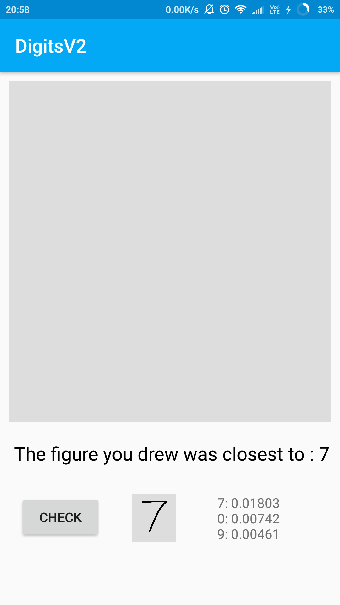
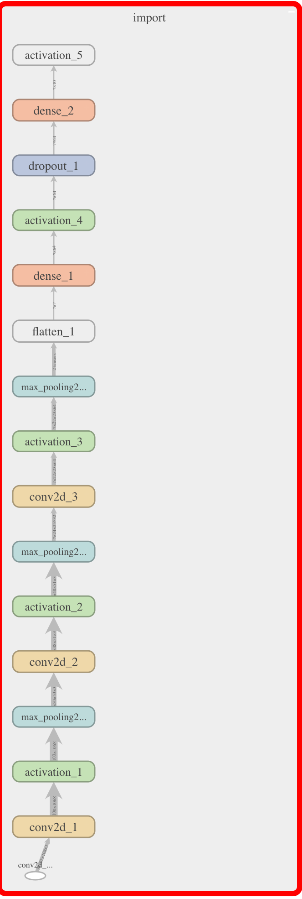

# DigitsClassifier
It is an attempt to classify digits drawn in an Android app from 0 to 9.

     

 
V1
1. Retrained mobilenet TF model for MNIST dataset to classify digits.
2. Accuracy was ~60% because of the difference in the digits drawn and the dataset.

V2
 

1. Trained the dataset created through the first app in a CNN model. [Dateset](https://drive.google.com/open?id=12JhP2ytGvePPyn7UtgW3MF1CLAsLUxhK) is available here.
2. Saved weights in summary.h5 file, created the Graph.pb TF file using [amir-abdi/keras_to_tensorflow](https://github.com/amir-abdi/keras_to_tensorflow). And then finally converted the Graph.pb file to a optimized_graph.lite file using tflite_convert(a TF utility).
3. The optimized_graph.lite file can be directly used in the app, which can now classify drawn digits with a ~60-70% accuracy.
4. The mobilenet model re-trained for the given dataset can classify drawn digits with accuracy upto ~90%.

## Tensorboard Visualization of Model

  
## Resources used
1. Keras Documentation
2. Tensorflow For Poets
3. [Drawing View](https://github.com/Raed-Mughaus/DrawingView) Library.
4. [amir-abdi/keras_to_tensorflow](https://github.com/amir-abdi/keras_to_tensorflow)
5. TFLite Convert
